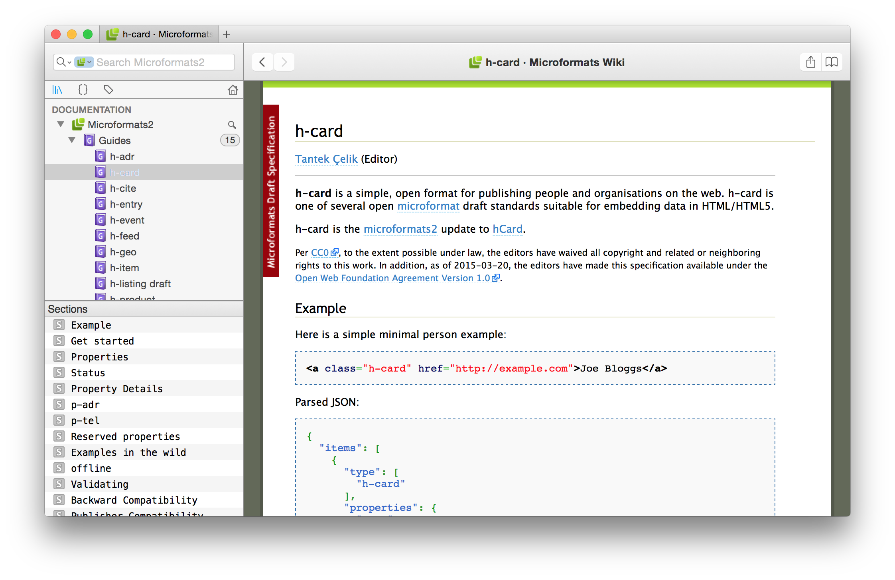

# dash-microformats2

dash-microformats2 is a docset for [Dash.app][] containing the latest [Microformats2 specs](http://microformats.org/wiki/microformats2).

## Installing

Install by opening Dash.app preferences, switch to `Downloads`, click `+`, and enter the feed URL
`https://raw.githubusercontent.com/pfefferle/dash-microformats2/master/microformats2.xml`.

## Build

To rebuild or update this docset run the following commands in the following order:

1. `$ sh sync.sh` to grab the newest version of the specs
1. `$ python rebuild.py` to generate the docset from the grabbed sources
1. `$ sh pack.sh` to build the tgz file for a new release

## Changelog

### 1.2.0

* added support for properties
* removed external dependencies (stylesheets and javascript)

### 1.1.0

* added guides
* added sections

### 1.0.0

* initial version

## Thanks

The [`sync.sh`][] and [`rebuild.py`][] scripts are based on [@willnorris][]' awesome [RFCDash Docset][] versions.

[Dash.app]: http://kapeli.com/dash
[open an issue]: https://github.com/pfefferle/dash-microformats2/issues
[`pack.sh`]: https://github.com/pfefferle/dash-microformats2/blob/master/pack.sh
[`sync.sh`]: https://github.com/pfefferle/dash-microformats2/blob/master/sync.sh
[`rebuild.py`]: https://github.com/pfefferle/dash-microformats2/blob/master/rebuild.py
[@willnorris]: https://willnorris.com
[RFCDash Docset]: https://github.com/willnorris/rfcdash
